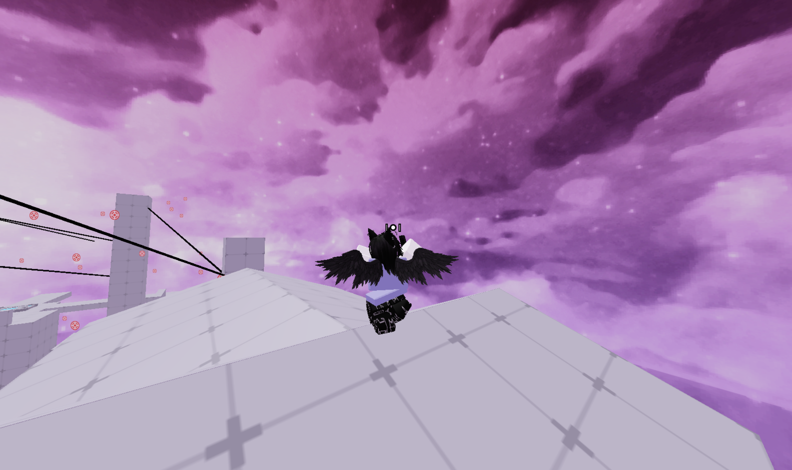

# Roblox Skybox Fix for Mac

This repository contains a shell script and assets to fix Roblox skyboxes on Mac. The skyboxes.zip and devy.mm2 - Roblox Skies (2).rar contain additional skies you can use.

## Important Information

- **YOU CANNOT USE THIS WITH GREY SKIES**
- Make sure no debug gray sky is enabled in your FFlags
- If it doesn't work, uninstall and reinstall Roblox following the troubleshooting steps below

## Installation Instructions

### Prerequisites

1. Download and install "The Unarchiver" to open RAR files: [https://theunarchiver.com/](https://theunarchiver.com/)

### Getting the Repository

You can get this repository in one of two ways:

1. **Using Git in Terminal** (if you have Git installed):
   ```bash
   git clone [repository-url]
   ```

2. **Download as ZIP**:
   - Click the "Code" button on GitHub
   - Select "Download ZIP"
   - Extract the ZIP file

### Running the Script

1. Navigate to the folder in Terminal:
   ```bash
   cd /path/to/skyboxfix
   ```
   
2. Run the shell script:
   ```bash
   ./move.sh
   ```

This will copy the necessary files to the correct Roblox storage locations.

## Manual Sky Installation

If you want to use skies from the skyboxes.zip or devy.mm2 - Roblox Skies (2).rar files:

1. Extract the ZIP and RAR files using "The Unarchiver"
2. Navigate to your Roblox application:
   - Find Roblox.app (usually in /Applications)
   - Right-click and select "Show Package Contents"
   - Navigate to: `Contents/Resources/PlatformContent/pc/textures/sky`
3. Choose which sky you like by looking at the PNG preview images
4. Copy ALL .tex files (NOT the image files) from the chosen sky folder
5. Paste and REPLACE all files in the Roblox sky folder

## FFlags (Fast Flags) Configuration

To get optimal performance and visuals with the skybox fix, you can use these FFlags.

### Creating the ClientSettings Folder

1. Navigate to your Roblox application:
   - Find Roblox.app (usually in /Applications)
   - Right-click and select "Show Package Contents"
   - Navigate to: `Contents/MacOS`
2. Create a folder called `ClientSettings` (exact spelling and capitalization)
3. Inside this folder, create a file called `ClientAppSettings.json` (exact spelling and capitalization)

### Recommended FFlags

Paste the following JSON into `ClientAppSettings.json`:

```json
{
"FIntFontSizePadding": "3",
"FFlagDebugGraphicsPreferD3D11": "True",
"FFlagTaskSchedulerLimitTargetFpsTo2402": "False",
"FStringPartTexturePackTablePre2022": "",
"FIntDebugForceMSAASamples": "1",
"DFIntTextureQualityOverride": "3",
"FFlagHandleAltEnterFullscreenManually": "False",
"DFIntCanHideGuiGroupId": "32380007",
"DFFlagDebugRenderForceTechnologyVoxel": "True",
"FFlagDebugCheckRenderThreading": "True",
"FIntRuntimeMaxNumOfThreads": "2400",
"FIntFullscreenTitleBarTriggerDelayMillis": "3600000",
"FLogNetwork": "7",
"DFFlagTextureQualityOverrideEnabled": "True",
"FIntDebugTextureManagerSkipMips": "0",
"DFFlagDisableDPIScale": "True",
"FStringTerrainMaterialTablePre2022": "",
"FFlagDebugForceFutureIsBrightPhase3": "True",
"FFlagRenderDebugCheckThreading2": "True",
"FFlagDisablePostFx": "True",
"FIntRenderShadowIntensity": "0",
"DFIntDebugFRMQualityLevelOverride": "1",
"FIntTerrainArraySliceSize": "0",
"FFlagHighlightOutlinesOnMobile": "True",
"FStringTerrainMaterialTable2022": "",
"FStringPartTexturePackTable2022": "",
"DFIntTaskSchedulerTargetFps": "9999"
}
```

## Troubleshooting

If the skybox fix doesn't work:

1. Uninstall Roblox completely
2. Delete any remaining files in:
   ```
   ~/Library/Roblox/
   ```
3. Redownload and reinstall Roblox from the official website
4. Redo all the steps above

## Notes

- The script copies files to `$HOME/Library/Roblox/rbx-storage` and its subdirectories
- Make sure to replace files, not just move them
- The skybox fix works best with the provided FFlags configuration
- Both xorfee and ricky use these FFlags for optimal performance

## Contact

For support or inquiries, you can reach the author:
- Discord: @salvali
- Roblox: [@SalValichu](https://www.roblox.com/users/profile?username=SalValichu)
- GitHub: [@SalValichu](https://github.com/SalValichu)
- Email: salvalichubizenquiries@gmail.com

